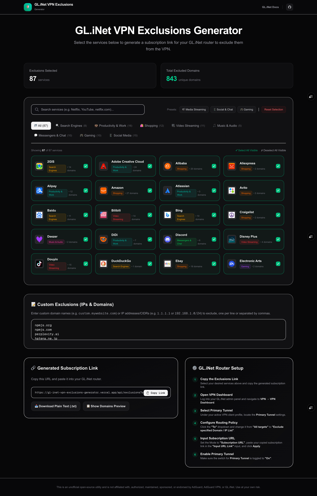

# GL.iNet VPN Exclusions Generator

A simple web tool to generate a domain and IP exclusion list for your GL.iNet router (running firmware v4.7+). 

This allows you to bypass the VPN for selected streaming platforms, social networks, games, or custom websites and IP addresses of your choice.



## How to Use

### Step 1: Select Services & Add Custom Rules
1. Open the web application.
2. Select the services you want to exclude from the VPN (e.g., Netflix, YouTube, Spotify).
3. (Optional) In the **Custom Exclusions** box, type any specific domains (e.g., `mybank.com`) or IP addresses (e.g., `1.1.1.1`) you also want to bypass the VPN, one per line.

### Step 2: Copy the Subscription Link
1. Once you have made your selections, click the **Copy Link** button next to the generated subscription URL.
2. The URL will look like: `https://your-domain.vercel.app/api/exclusions?services=netflix%2Cyoutube&custom=mybank.com`

### Step 3: Paste the Link into Your GL.iNet Router
1. Log into your GL.iNet Admin Panel.
2. Go to **VPN** ➔ **VPN Dashboard**.
3. Under your active VPN profile (e.g., WireGuard or OpenVPN), look for the **Primary Tunnel** settings.
4. Click the **To** dropdown and select **Exclude specified Domain / IP List**.
5. Set the Mode switch to **Subscription URL**.
6. Paste the copied subscription link into the **Input URL Link** field.
7. Click **Apply** (or **Detect**).
8. Ensure the **Primary Tunnel** toggle is switched **On**.

---

## Troubleshooting & Tips

### 1. The VPN is still being used on my devices
For domain-based VPN policies to work, your router must handle the DNS requests directly:
* **Turn off Private DNS / DoH**: Make sure features like "Private DNS" (Android), "Limit IP Address Tracking" (iOS/macOS), or "DNS over HTTPS" (browsers) are disabled on your client devices.
* **Use Router DNS**: Ensure your client devices use the router's LAN IP address as their primary DNS server.
* **Flush DNS Cache**: If rules don't apply immediately, clear your device's DNS cache (run `ipconfig /flushdns` in Windows Command Prompt, or restart your device).

### 2. Formatting custom entries
* **Root domains** (e.g., `example.com`) will automatically match the domain and all of its subdomains (like `www.example.com`).
* If you want to bypass the VPN for a **specific subdomain** only, enter the full subdomain (e.g., `login.example.com`).
* You can add raw IPv4 addresses (e.g., `1.2.3.4`) or CIDR blocks (e.g., `192.168.1.0/24`).

---

## Local Development

If you want to run this application locally:

### 1. Install Dependencies
```bash
bun install
```

### 2. Run the Development Server
```bash
bun run dev
```
Open [http://localhost:3000](http://localhost:3000) in your browser.

---

## Deployment

Deploy this tool to **Vercel** in seconds:

1. Push this repository to your GitHub profile.
2. Import the project into your Vercel Dashboard.
3. Deploy! The `/api/exclusions` subscription URL is ready to use on your router.
